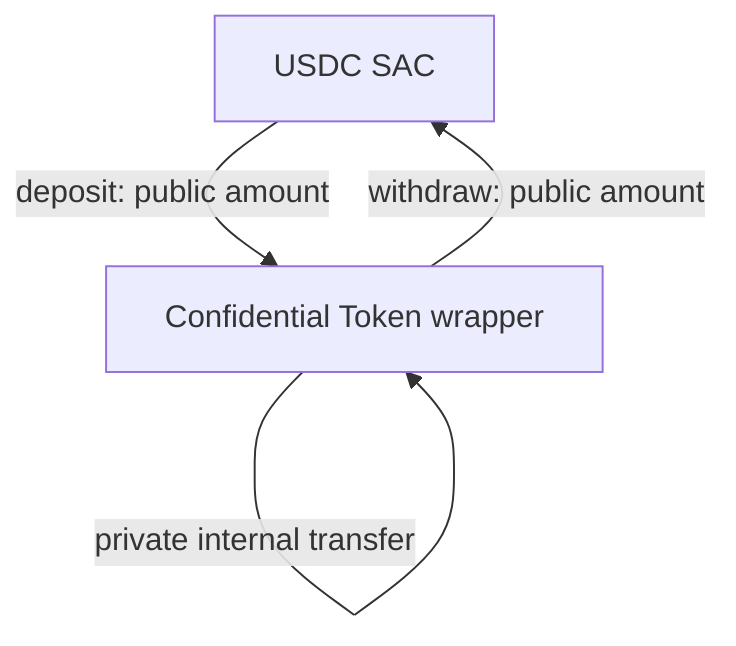
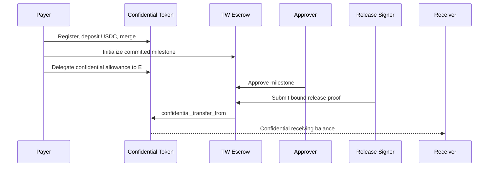
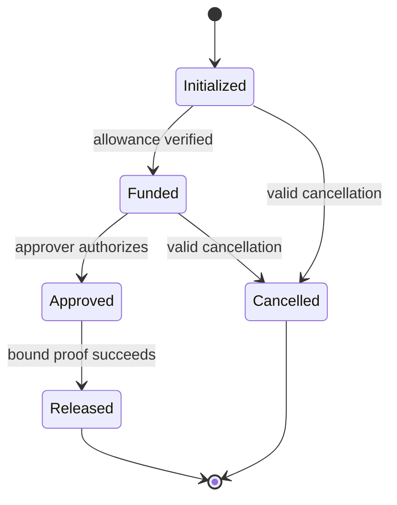

# PoC Architecture

## Objective

Integrate a one-milestone Trustless Work escrow with Stellar Confidential Tokens without revealing the agreed or released amount on-chain. The escrow lifecycle remains publicly inspectable; value is represented through commitments and proven state transitions.

## System boundaries

| Component | Responsibility | Source strategy |
|---|---|---|
| Confidential Token | Wrap SEP-41 USDC; register, deposit, merge, transfer, withdraw | Reuse pinned reference implementation |
| UltraHonk verifier | Verify Noir proofs on-chain | Reuse pinned upstream verifier |
| Auditor registry | Register the designated Grumpkin auditor key | Reuse pinned reference implementation |
| Confidential escrow | Enforce roles, state, approval, cancellation, and proof-bound release | New Trustless Work contract |
| SDK | Generate proofs, reconstruct confidential state, submit transactions | Extend reference SDK |
| Disclosure package | Prove one payment to one designated verifier | Reuse, then adapt labels/domain separation |
| Indexer | Preserve the complete confidential-event history | Adapt reference Goldsky package |
| Demo app | Exercise payer, receiver, approver, release signer, and auditor flows | Extend reference Next.js app |

## Asset model

USDC remains the underlying asset. The Confidential Token contract is a wrapper over its SEP-41 interface:

Deposits and withdrawals remain public. Internal balances and transfers are confidential. The underlying USDC is held inside the wrapper contract; the wrapper does not modify USDC itself.

## Escrow flow

## State model

The minimal lifecycle is:

An escrow must never infer `Funded` solely from a client assertion. It must validate the confidential allowance or a cryptographic receipt tied to the escrow.

## Milestone binding

The escrow stores `amount_commitment`, not plaintext `amount`. A valid release must bind all of the following into the proven statement or an equivalent non-malleable authorization:

- confidential amount/opening;
- escrow contract and `escrow_id`;
- `milestone_id`;
- receiver confidential public key/address;
- payer allowance state or nonce;
- chain/network domain;
- current approval state;
- one-time release nonce.

The core invariant is:

`committed milestone amount == delegated spend amount == receiver transfer amount`

The preferred implementation is to extend the delegated-transfer circuit so this equality and the escrow domain are verified in a single proof. A separate equality proof is acceptable only if proof composition cannot permit substitution or replay between escrow and transfer calls.

## Trust boundaries

- **On-chain contracts:** authoritative for escrow status, roles, commitments, and proof verification.
- **Client SDK:** holds openings and derives proofs; compromise can expose the user's own confidential state.
- **Indexer:** availability-critical for recovery, but reconstructed openings must be checked against on-chain commitments.
- **Auditor:** intentionally privileged to decrypt covered amounts; auditor-key custody is outside the chain's guarantees.
- **Approver/release signer:** cannot alter amounts, but can authorize lifecycle transitions according to their role.

## Compatibility rule

The PoC does not modify Trustless Work production v2. Integration lives in a separate escrow contract until delegated spending, recovery, auditability, fees, and cancellation are proven safe.
