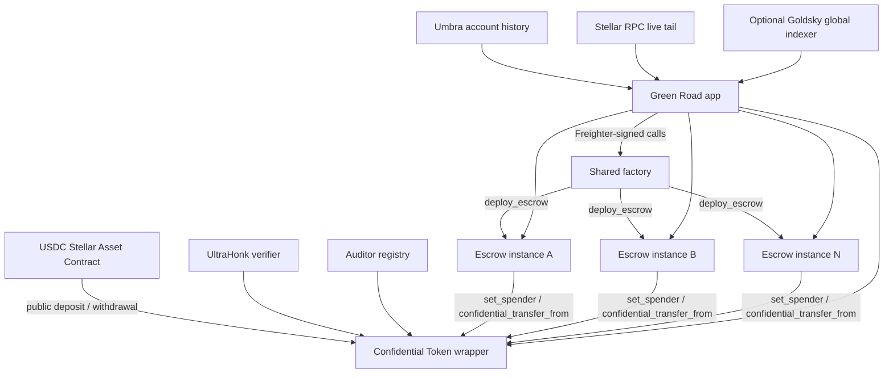
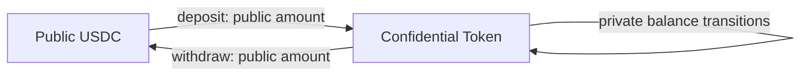
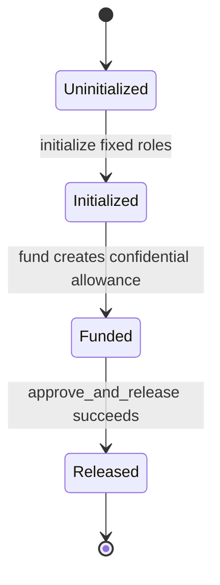
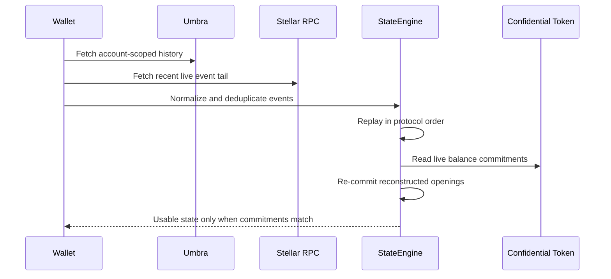

# Privacy PoC architecture

Last updated: August 4, 2026.

## Objective

The PoC evaluates whether Trustless Work can execute a milestone escrow payment through Stellar Confidential Tokens without publishing the agreed or released amount on-chain.

The current design proves a narrow but meaningful invariant:

```text
receiver transfer amount == complete pre-release confidential allowance
```

The public chain remains authoritative for roles, lifecycle state, commitments, and proof verification. Confidential values are reconstructed by authorized clients from encrypted event material and accepted only when they open the live on-chain commitments.

## Current deployment topology

The protocol is deployed once per environment. Individual business escrows are created later through a shared factory.



### One-time protocol deployment

`scripts/deploy.ts` provisions and configures:

- the verifier contract;
- the auditor registry;
- the confidential-token wrapper over the configured USDC SAC;
- the shared factory and its installed WASM hashes; and
- the public application deployment manifest.

This operation establishes a new protocol environment. It must not be rerun merely to create a new escrow.

### Per-escrow deployment

An Approver creates an escrow from the browser:

1. Freighter signs a factory `deploy_escrow` transaction.
2. The factory deploys a fresh, uninitialized escrow contract.
3. The application receives the new contract address.
4. The browser derives the escrow-bound confidential registration material.
5. Freighter signs the escrow initialization transaction.
6. The escrow permanently records the Payer, Receiver, Approver, and Confidential Token contract.
7. The application stores the escrow ID in browser-local history and selects it as active.

The same participant addresses may be reused across different escrow instances because every contract has independent state.

## Component responsibilities

| Component | Responsibility | Authority and trust |
|---|---|---|
| USDC SAC | Public underlying asset used for deposit and withdrawal | Authoritative for public USDC balances |
| Confidential Token | Confidential accounts, balances, allowances, proof verification dispatch, and encrypted events | Authoritative for commitments and delegation state |
| UltraHonk verifier | Verifies the pinned Noir proof systems | Authoritative only for the configured verification keys |
| Auditor registry | Maps auditor IDs to Grumpkin public keys | Intentionally grants configured audit visibility |
| Factory | Deploys fresh escrow contracts from installed WASM | Deployment mechanism; not part of an escrow lifecycle |
| Escrow | Fixes roles, creates one allowance, and atomically releases it in full | Authoritative for lifecycle and nested spending authorization |
| SDK | Builds witnesses, proofs, XDR calls, event decoders, and reconstructed state | Holds user secrets; reconstructed state must match chain commitments |
| Umbra | Supplies durable account-scoped encrypted history | Availability source, never balance authority |
| Stellar RPC | Supplies current contract reads and the recent event tail | Chain-facing source of truth within retention limits |
| Goldsky indexer | Intended global durable event source | Availability source; checked-in pipeline is not yet complete for spender events |
| Green Road app | Orchestrates roles, Freighter, proving, selection, and diagnostics | Browser state is operationally important but not authoritative on its own |

## Asset model

USDC remains the underlying asset. The Confidential Token contract wraps its SEP-41 interface:



Deposits and withdrawals remain public. Internal balances, allowances, and transfers are commitments with encrypted recovery data.

All contract and proof arithmetic uses integer base units. Display conversion is a UI concern.

## Escrow lifecycle

Every escrow models exactly one milestone:



There is no reset or reuse path. Another milestone requires another escrow instance.

### Initialization

The Approver initializes the newly deployed contract with fixed Payer and Receiver addresses. The escrow registers itself as a Confidential Token account because the release proof and encrypted allowance channel are bound to the spender contract address.

### Funding

The Payer calls the escrow's `fund` entry point. The escrow atomically invokes `set_spender` on the Confidential Token contract.

The plaintext amount exists only in the Payer's private witness. The resulting confidential allowance is stored by the token contract under the `(payer, escrow)` delegation entry.

The token emits an owner-encrypted `set_spender` checkpoint containing the Payer's post-funding spendable opening. This event is required for durable owner recovery and outgoing history reconstruction.

### Release

The Approver submits one full-release proof to `approve_and_release`. The escrow invokes `confidential_transfer_from` as the configured spender and fixed Receiver.

The modified Noir circuit retains the upstream delegated-transfer checks and adds:

```text
new_allowance_value == 0
```

The release therefore equals the complete allowance. Soroban transaction atomicity ensures the escrow cannot enter `Released` if the nested transfer or proof verification fails.

## Public and confidential data

### Public lifecycle data

- escrow contract address;
- Payer, Receiver, and Approver addresses;
- Confidential Token and factory addresses;
- status transitions;
- transaction timing and invocation graph;
- public deposits and withdrawals; and
- any application-layer order metadata published outside the confidential protocol.

### Confidential value data

- private `Receiving` balance;
- private `Spendable` balance;
- delegated allowance value;
- ordinary confidential transfer amounts; and
- escrow release amount.

### Controlled disclosure

- A configured Auditor can decrypt supported protocol channels.
- A transfer holder can generate supported selective-disclosure proofs.
- The Payer cannot claim a sender proof for `spender_transfer`, because the escrow contract generated that delegated transfer's ephemeral cryptography.
- The Payer may still see the release amount locally by pairing the verified `set_spender` allowance with the full-release event.

## Event model

### Confidential Token events consumed by the SDK

| Event | State effect |
|---|---|
| `register` | Marks the account registered |
| `deposit` | Adds public deposit value to private `Receiving` |
| `merge` | Moves `Receiving` into `Spendable` |
| `withdraw` | Replaces the owner's `Spendable` opening with an encrypted checkpoint |
| `transfer` | Updates sender `Spendable` and credits receiver `Receiving` |
| `set_spender` | Updates owner `Spendable` and records an allowance checkpoint |
| `revoke_spender` | Restores remaining allowance and updates owner `Spendable` |
| `spender_transfer` | Credits Receiver `Receiving`; in this PoC it exhausts one escrow allowance |

### Escrow lifecycle events

- `init`;
- `funded`; and
- `released`.

### Factory events

The factory currently returns a deployed address but emits no `escrow_deployed` event. Consequently, existing escrows cannot be globally discovered from the factory history. The application directory is browser-local.

## Recovery architecture



Key properties:

- Confidential keys are derived from a deterministic, deployment-bound Freighter signature.
- Umbra is replayed on every sync when configured, so stale or partial browser caches can be rebuilt.
- RPC and Umbra event IDs are normalized into a common identity.
- Deduplication uses both cursor and protocol payload identity.
- Same-ledger event order is preserved because state transitions are order-sensitive.
- Incoming amounts can be decrypted independently from recipient ciphertext.
- Inferred outgoing amounts are exposed only after complete replay matches both current on-chain balance commitments.

See [Recovery model](recovery-model.md) for the detailed algorithm and failure modes.

## Browser-local state

The application currently stores:

- derived confidential key cache;
- reconstructed balance openings;
- sync cursor and cache version;
- known escrow IDs per Confidential Token deployment; and
- selected escrow ID.

Balance state is recoverable when complete compatible history exists. The escrow directory is not yet recoverable automatically because the factory lacks a discovery event.

Changing the active escrow disconnects the previous controller so a transaction cannot be accidentally submitted to the prior contract.

## Trust boundaries

### On-chain contracts

Authoritative for:

- role configuration;
- lifecycle status;
- account and allowance commitments;
- proof verification; and
- atomic state transitions.

### Client SDK and browser

The SDK holds confidential openings and proving material. Compromise can expose the user's own private state. Browser state must never be trusted without re-committing openings against the chain.

### Event providers

Umbra, RPC adapters, and indexers can omit, duplicate, reorder, or corrupt events. The client mitigates this through normalization, logical deduplication, stable replay ordering, and final commitment checks.

Availability failures can still prevent recovery even when they cannot forge a valid opening.

### Auditor

The configured Auditor is intentionally privileged. Auditor-key custody, rotation, scope, and incident handling are outside the current on-chain guarantees.

### Approver/prover

The Approver controls release timing and holds the PoC spender proving material. The fixed Receiver and full-release circuit prevent the Approver from selecting another recipient or a partial amount.

## Compatibility boundary

This PoC does not modify Trustless Work production v2. It uses a separate escrow contract and a dedicated Confidential Token deployment with PoC-specific verification keys.

Moving toward production requires independent decisions for:

- multi-milestone and partial releases;
- cancellation and disputes;
- platform fees;
- durable escrow discovery;
- indexer completeness and retention guarantees;
- confidential key custody and recovery;
- auditor governance;
- circuit and contract audits; and
- leakage analysis for deposits, withdrawals, timing, addresses, and metadata.

## Known architectural limitations

- One contract equals one milestone.
- Release always exhausts the complete allowance.
- The Payer may revoke the delegation before release.
- Factory-created escrows are not globally discoverable.
- The checked-in Goldsky pipeline omits `set_spender`, `revoke_spender`, and `spender_transfer`.
- Recovery depends on compatible event availability and authorized confidential keys.
- The design hides value, not addresses, transaction graph, timing, network metadata, or application content.
- All cryptography remains developer preview and testnet only.
