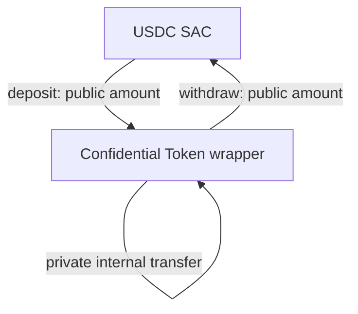
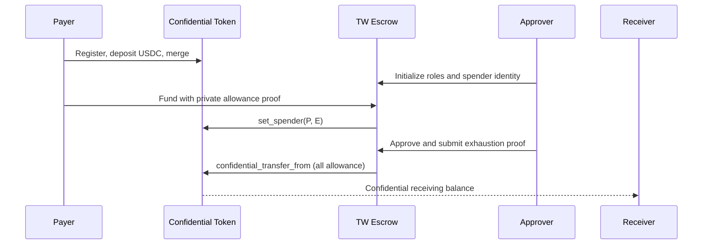
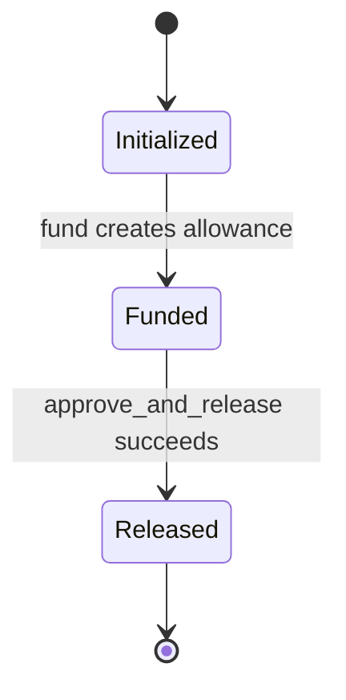

# PoC Architecture

## Objective

Integrate a one-milestone Trustless Work escrow with Stellar Confidential Tokens without revealing the agreed or released amount on-chain. The escrow lifecycle remains publicly inspectable; value is represented through commitments and proven state transitions.

## System boundaries

| Component | Responsibility | Source strategy |
|---|---|---|
| Confidential Token | Wrap SEP-41 USDC; register, deposit, merge, transfer, withdraw | Reuse pinned reference implementation |
| UltraHonk verifier | Verify Noir proofs on-chain | Reuse pinned upstream verifier |
| Auditor registry | Register the designated Grumpkin auditor key | Reuse pinned reference implementation |
| Confidential escrow | Enforce payer, receiver, approver, funding confirmation, and atomic full release | New Trustless Work contract |
| SDK | Generate proofs, reconstruct confidential state, submit transactions | Extend reference SDK |
| Disclosure package | Prove one payment to one designated verifier | Reuse, then adapt labels/domain separation |
| Indexer | Preserve the complete confidential-event history | Adapt reference Goldsky package |
| Demo app | Exercise payer, receiver, approver, and auditor flows | Extend reference Next.js app |

## Asset model

USDC remains the underlying asset. The Confidential Token contract is a wrapper over its SEP-41 interface:

Deposits and withdrawals remain public. Internal balances and transfers are confidential. The underlying USDC is held inside the wrapper contract; the wrapper does not modify USDC itself.

## Escrow flow

## State model

The minimal lifecycle is:

An escrow must never infer `Funded` solely from a client assertion. It must validate the confidential allowance or a cryptographic receipt tied to the escrow.

## Full-release binding

The confidential allowance is the one-milestone escrow amount. The escrow stores no separate amount or amount commitment. A valid release must prove:

- the current allowance opening is valid;
- the transfer is to the receiver configured by the escrow;
- the post-transfer allowance value equals zero;
- the new allowance and receiver-transfer commitments are correctly formed;
- the proof references the current allowance commitment, making replay fail.

The core invariant is:

`receiver transfer amount == complete pre-release allowance`

The `approve_and_release` entry point invokes the confidential-token contract in the same Soroban transaction. State changes are atomic: if proof verification or transfer fails, the escrow cannot become `Released`.

## Trust boundaries

- **On-chain contracts:** authoritative for escrow status, roles, commitments, and proof verification.
- **Client SDK:** holds openings and derives proofs; compromise can expose the user's own confidential state.
- **Indexer:** availability-critical for recovery, but reconstructed openings must be checked against on-chain commitments.
- **Auditor:** intentionally privileged to decrypt covered amounts; auditor-key custody is outside the chain's guarantees.
- **Approver/prover:** holds the PoC escrow-spender proving material, authorizes the release, and cannot choose a partial amount because the modified spender-transfer circuit requires allowance exhaustion.

## Compatibility rule

The PoC does not modify Trustless Work production v2. Integration lives in a separate escrow contract until delegated spending, full-release enforcement, recovery, and auditability are proven safe.
